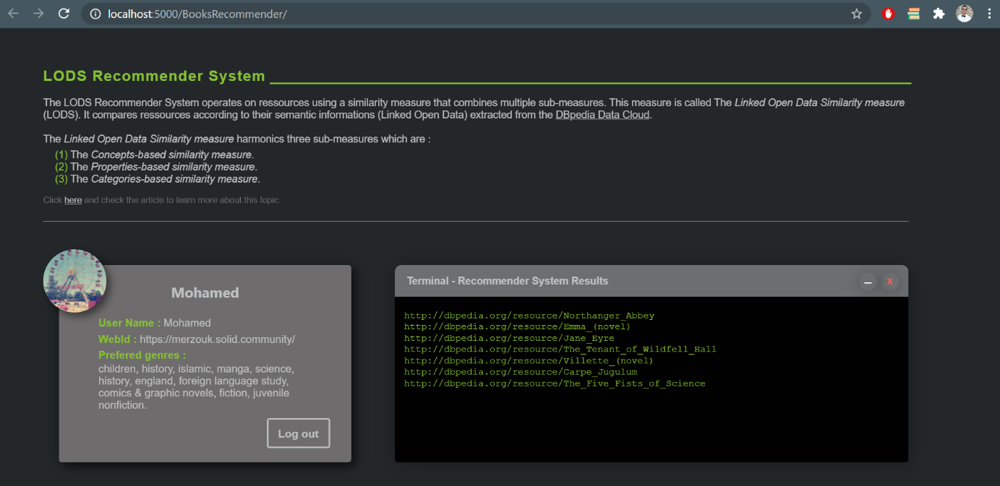

# LODS Recommender System
**LODS RS**, a plateform offering a LODS based recommender system. Recommends everything within the DBpedia Dataset.

## Motivation
The decentralized plateform **LODS RS** was created in order to calculate similarity scores between different data types using the [LODS mesure](https://ieeexplore.ieee.org/abstract/document/7536467).

## Screenshots



## Installation

To use the application, you should install the following tools and packages via the terminal of your code editor ( Ex. [Visual Studio Code](https://code.visualstudio.com/download).
Since all necessary packages are present in the ***package.json*** file, you can run :

```bash
npm install
```
Or re-install everything, one package at a time or more (use spacing between package names in the command) :

```bash
npm install <tool_or_library_name>
```

or use the **yarn** command :

```bash
yarn install <tool_or_library_name>
```

#### Datasets

  - To begin, download the following file [CSVFiles.zip](http://www.mediafire.com/file/ouzkwbhogsyrj27/CSVFiles.zip/file).
  - Open the **LODS RSP** project repository in the code editor.
  - In the files hierarchy of the project, browse to the following repository : <YOUR_ROOT>/Application/Recommender System/Backend/CSVFiles.
  - Extract the *CSVFile.zip* file then copy the content in the previous path. 
  
#### Application Frontend
  - [ReactJs](https://fr.reactjs.org/)
  
#### Application Backend
  - [Node.js](https://nodejs.org/en/)
  - [Express.js](https://expressjs.com/fr/)
  
#### Solid Libraries
  - [Solid Auth Client](https://github.com/solid/solid-auth-client)
  - [ACL Check](https://github.com/solid/acl-check)
  - [rdflib.js](https://github.com/linkeddata/rdflib.js/)
  - [Solid File Client](https://github.com/jeff-zucker/solid-file-client)
  - [Solid React Components](https://github.com/solid/react-components)
  
#### Additional libraries

  - React's **nodeModules**, which can be installed as follows : 
  
```bash
npm install
```
or : 
```bash
yarn install
```
  - [react-toastify](https://www.npmjs.com/package/react-toastify)
  - [react-tooltip](https://www.npmjs.com/package/react-tooltip)
  - [react-icons/fa](https://react-icons.github.io/react-icons/)
 
   
## Dataset reference

  - [DBpedia Dataset](https://wiki.dbpedia.org/)

## Features

**LODS RSP** offers the following functionnalities : 

- Read user profile to get his preferences.
- Possibility to view the user card with the retrieved informations.
- Calculate similarity scores using the LODS mesure.
- Possibility to view the list of recommendations on a terminal screen.

## Application usage
The only action the user would have to do is to login to the provider using his Solid POD identifiers (WebID , password).

## Credits
  [Özcan Seker](https://github.com/ozcanseker/Social-linked-beer).
  
## Developers contact
  - [Rania Benchouiekh](https://github.com/RaniaBenchouiekh)
  - [Mohamed Merzouk](https://github.com/Mohamed-MERZOUK)

